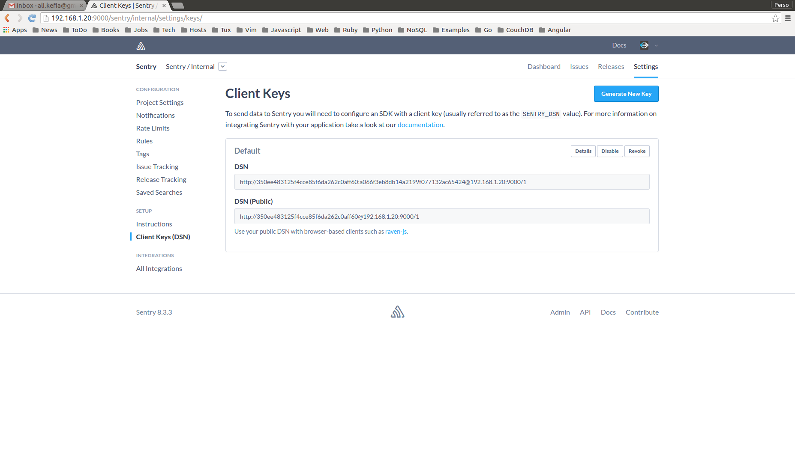

# COOG ADMIN

Coog Admin is a toolkit that makes it easy to manage Coog (Insurance ERP from
Coopengo). It is aimed to provide all useful commands to:

- Deploy Coog (in all recommended configurations)
- Administrate Coog (monitor in runtime, upgrade, maintenance procedure, etc)
- Help on Coog troubleshooting (shared knowledge base between all Coog
  installtions)

Coog Admin should be installed (cloned) on Coog host server. All other resources
are provides via Docker images.

[Docker](https://www.docker.com/) is the recommended platform to deploy Coog:

- Makes it easy to communicate with sys admins
- Optimal to support all kind of Operating Systems
- Helpful to get integrated with third party softwares (right now we use
  postgresql, redis, nginx, sentry, etc)

Coog Admin is a passive tool. It does not launch any agent on your server. All
provided deployment scripts are just docker calls wrappings.

For the first versions, Coog Admin will be focused on deployment.

## What is this tool

- Set of shell scripts to ensure operations
- All operations scripts source a special script (`.env`) that sets the
  configuration
- `.env` last line is:
  ```
  [ -f $PREFIX/env ] && source $PREFIX/env
  ```
  this call describes the way we manage overriding in coog-admin. All configuration
  variables can be set on your custom script to change the way the scripts work.
- `/usr/local/coog` contains ALL Coog specific data (no worry, we keep your
  server clean)

    - Never modify Coog Admin directly
    - To clean your environment, you can just delete `/usr/local/coog` folder

It is very recommended to read the scripts to have a deep understanding of how
it works:

- [.env](https://github.com/coopengo/coog-admin/blob/master/.env): configuration
  items explained
- [postgres](https://github.com/coopengo/coog-admin/blob/master/postgres):
  typical launcher

### Content description

All commands print commands list when called without arguments

- pull: pulls all needed images for Coog
- clean: useful to clean old images on filesystem
- .env: all configuration variables
- redis: launches redis (client and server) from a docker image
- postgres: launches postgres (client and server) from a docker images
- sentry: runs sentry (server and workers) from a docker images. This could link
  to redis and postgres docker container or points to other servers (depending
  on configuration). Default is link to Docker
- coog: runs coog (workers, batch). It links to redis and postgres based on
  configuration
- nginx: launches nginx as a reverse proxy and load balancer for Coog
    - a commented configuration example is provided [here](https://github.com/coopengo/coog-admin/blob/master/config/nginx.conf)
    - this could be overridden is `/usr/local/coog/nginx.conf`

## Use case

### Situation

- You start working on Coog
- You have an archive with the Coog image (coog.tar.gz)
- You have no initial dataset

### Steps

- First you need to load your image [load command](https://docs.docker.com/engine/reference/commandline/load/)
    - load: `docker load -i coog.tar.gz`
    - check that your image is there: `docker images`
    - edit `/usr/local/coog/env` to set Coog image name (example below)

    ```
    COOG_IMAGE=coog/coog:1.8
    ```

- Pull images: `./pull` to get all needed images to run Coog

- Start redis: be careful, redis supports and keeps his data on `/usr/local/coog/redis`
  (persistent event after container restarting)
    - start redis server: `./redis server`
    - `./redis client` lets you connect to your server to check this step

- Start postgres: be careful, postgres keeps its data on a `/usr/local/coog/pg`
  (persistent even after containers restarting)
    - start postgres server: `./postgres server`
    - `./postgres client` let you connect to your server (default password is `postgres`)
    - if this is the first time, you need to create your database:
      `create database coog owner postgres encoding 'utf8';`

- Start sentry: [sentry](https://getsentry.com/welcome/) is connected natively to Coog.
  It makes it easy to live troubleshoot the application.
    - `./sentry set_key`: generates a secret key for sentry deployment (used to
      recognise different workers)
    - `./sentry init_conf`: generates a default configuration file for sentry
    - edit `/usr/local/sentry/config.yml` to set exposed hostname and port of sentry
    - `./postgres client`: creates a database for sentry (default name is sentry)
    - `./sentry upgrade`: populates sentry database (create tables and minimal dataset)
    - `./sentry worker`: starts a celery worker for sentry (async treatments)
    - `./sentry beat`: starts a celery beat worker for sentry (async treatments)
    - `./sentry server`: starts sentry server
    - now sentry is listening on port 9000 (of the host machine). You can connect to get your dsn (public key, private key)

    

- Start Coog
    - edit `/usr/local/coog/env` to set sentry dsn keys (example below)

    ```
    COOG_SENTRY_PROJECT=1
    COOG_SENTRY_PUB=c5811bbab3444364b753df155dd8cc8e
    COOG_SENTRY_SEC=56fb9bb6270e4221b1496a835e2dea8e
    ```

    - if you start on a new database, you should initialize it (create tables
      and minimal dataset) by calling `./coog upgrade`
    - start Coog workers: `./coog workers`: (workers number could be set on `/usr/local/coog/env`)

- Start nginx
    - `./nginx init`: generates a default nginx config file
    - `./nginx serve`: starts nginx to load balance on coog workers
    - now nginx is listening on port 80 (of the host machine). You can connect your client.

This example is a basic one. Keep in mind that you can customize it to have a more adapted configuration:
- database on a dedicated server (no docker for postgres)
- sentry and Coog on different database servers

Please refer to [.env](https://github.com/coopengo/coog-admin/blob/master/.env) script to deep into those possibilities.
