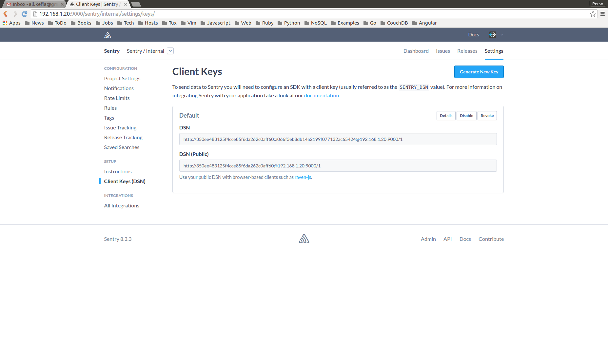

# COOG ADMIN

Coog Admin is a toolkit that makes it easy to manage Coog (Insurance ERP from
[Coopengo](http://www.coopengo.com)). It is aimed to provide all useful commands to:

- Deploy Coog (in all recommended configurations)
- Administrate Coog (monitor in runtime, upgrade, maintenance procedure, etc)
- Help on Coog troubleshooting (shared knowledge base between all Coog
  installations)

Coog Admin should be installed (cloned) on Coog host server. All other resources
are provides via Docker images.

[Docker](https://www.docker.com/) is the recommended platform to deploy Coog:

- Makes it easy to communicate with system administrators
- Designed to support all kind of Operating Systems
- Helpful to get integrated with third party softwares (right now we use
  postgresql, redis, nginx, sentry, etc)

Coog Admin is a passive tool. It does not launch any agent on your server. All
provided deployment scripts are just docker calls wrappings.

For the first versions, Coog Admin will be focused on deployment.

## What is this tool

- Set of shell scripts to ensure operations
- All Coog data are stored in **one folder** named `$PREFIX`
    - This ensures that the host server is kept clean (no files at different locations).
    - By default `$PREFIX` is mapped to `/usr/local/coog`.
    - It could be overridden by setting `COOG_DATA` (maybe in user's `.profile`)
    - A good practice is to use `data` folder inside coog-admin (git ignored)
- Coog data includes postgresql databases, redis persistency, coog documents.
  All those are stored in sub-fodlers of `$PREFIX`.
- All operations scripts source a special script (`config`) that sets the
  configuration
- `config` last line is:

  ```
  [ -f $PREFIX/config ] && source $PREFIX/config
  ```
  Basically, all the configuration is done through environment variables, which
  are defined in `config`. To modify the configuration, just set your updated
  environment variables in `$PREFIX/config`.
- To clean your environment, you can just remove `$PREFIX` folder

It is very recommended to read the scripts to have a deep understanding of how
it works:

- [config](https://github.com/coopengo/coog-admin/blob/master/config): configuration
  items explained
- [postgres](https://github.com/coopengo/coog-admin/blob/master/postgres):
  typical launcher

### Content description

All commands print commands list when called without arguments

- `edit-config`: edits custom config script
- `pull`: pulls all needed images for Coog
- `config`: all configuration variables
- `redis`: launches redis (client and server) from a docker image
- `postgres`: launches postgres (client and server) from a docker images
- `sentry`: runs sentry (server and workers) from a docker images. This could link
  to redis and postgres docker container or points to other servers (depending
  on configuration). Default is link to Docker
- `coog`: runs coog (workers, batch). It links to redis and postgres based on
  configuration
- `nginx`: launches nginx as a reverse proxy and load balancer for Coog
    - a commented configuration example is provided [here](https://github.com/coopengo/coog-admin/blob/master/defaults/nginx.conf)
    - this could be overridden using `./nginx edit`
- `dwh` : launches postgres datawarehouse (client and server) from a docker image
- `pentaho` : run pentaho datawarehouse build and/or server, recquire a different 
  server running for the datawarehouse different of 
    - you can change database and shared files configuration with `./pentaho edit`
    - independant docker _How to_ is availablle [here](https://github.com/coopengo/coog-bi/)
## Use case

### Situation

- You start working on Coog
- You have an archive with the Coog image (coog.tar)
- You have no initial dataset

### Steps

- First you need a hosting Linux server (dedicated or virtual)
    - Install Git, Docker
    - create a dedicated system user for Coog IT operations (not root and no sudo)
    - add this user to `docker group` (it needs to launch containers)
    - set `COOG_DATA` value for the user (on `~/.bashrc` or `~/.profile`). This is the path for the exchange volumes (typically: `~/.local/share/coog`)
    - `(cd ~ && git clone https://github.com/coopengo/coog-admin)` to install coog-admin
    - all latter commands will suppose that you are on `~/coog-admin` folder

- You need to load your image [load command](https://docs.docker.com/engine/reference/commandline/load/)
    - load: `docker load -i coog.tar`
    - check that your image is there: `docker images`
    - `./edit-config` to set Coog image name (example below)

    ```
    COOG_IMAGE=coog/coog:X.Y
    ```

- Pull images: `./pull` to get all needed images to run Coog, requires internet
    connection to [DockerHub](https://hub.docker.com/)

- Start redis: be careful, redis supports and keeps his data on host server
  (persistent even after container restarting)
    - `./redis server` to start redis server
    - `./redis client` lets you connect to your server to check this step

- Start postgres: be careful, postgres keeps its data on a host server
  (persistent even after containers restarting)
    - `./postgres server` to start postgres server
    - `./postgres client` let you connect to your server (default password is `postgres`)
    - if this is the first time, you need to create your database:
      `create database coog owner postgres encoding 'utf8';`

- Start sentry: [sentry](https://getsentry.com/welcome/) is connected natively to Coog.
  It makes it easy to live troubleshoot the application.
    - `./sentry set_key`: generates a secret key for sentry deployment (used to
      recognise different workers)
    - `./postgres client`: creates a database for sentry (default name is sentry)
    - `./sentry upgrade`: populates sentry database (create tables and minimal dataset)
    - `./sentry worker`: starts a celery worker for sentry (async treatments)
    - `./sentry cron`: starts sentry cron
    - `./sentry server`: starts sentry server

    

- Start Coog
    - `./edit-config` to set sentry dsn keys (example below)

    ```
    COOG_SENTRY_PROJECT=1
    COOG_SENTRY_PUB=123456789abcdef123456789abcdef12
    COOG_SENTRY_SEC=123456789abcdef123456789abcdef12
    ```

    - if you start on a new database, you should initialize it (create tables
      and minimal dataset) by calling `./coog upgrade`
    - start Coog workers: `./coog workers`: (workers number could be set via `./edit-config`)

- Start nginx
    - `./nginx init`: generates a default nginx config file
    - `./nginx run`: starts nginx to load balance on coog workers
    - now nginx is listening on port 80 (of the host machine). You can connect your client.

This example is a basic one. Keep in mind that you can customize it to have a
better (as in 'closer to your needs') configuration:
- database on a dedicated server (no docker for postgres)
- sentry and Coog on different database servers

Please refer to [config](https://github.com/coopengo/coog-admin/blob/master/config)
script to acquire a better understanding of those possibilities.

### BI

First of all, you have to set up a running server to host your datawarehouse.

Initiate configuration file with `./pentaho init`

If you own your own server, just set up database configuration and shared
folder : `./pentaho edit`

If not follow the same step as `postgres` but with `dwh` and name your database
like pentaho parameter `DW_DB_NAME`

Now you have to build the docker images, just run `./pentaho build`

When it ends, run `./pentaho run` then datawarehouse will build itself, and the
server is now running.

After that if you want only one service running, run `./pentaho <commands>
<images>`, it will run the command for the docker images and build only this
one.

We recommend you to run the etl image at least.

If you have the server running, you'll maybe want to import defaults reports
and OLAP cubes : `./pentaho import`

/!\ You have to add your datawarehouse connection to the server. Follow this
step:
 - Connect to your server within your browser : `ip:port`
 - Connect as an admin login : `admin`, password : `password`
 - Wait, then click on `manage datasource`
 - Click on the wheel then `new connection`
 - Select postgresql then add your parameters :
    - Hostname : `<NETWORK_NAME>-postgres-dw`
    - Database : `<DW_DB_NAME>`
    - Port : `<DW_DB_PORT>`
    - User : `<DW_DB_USER>`
    - Password : `<DW_DB_PASSWORD>`

Now if you want to learn more about the bi server just follow this wiki
