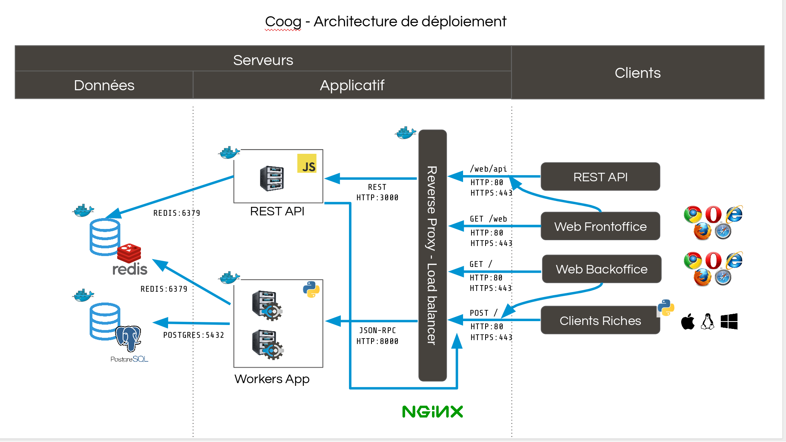

# Coog Deployment



**coog-admin** is a utility which allows handling **Coog** deployments
and easing its administration. In general, each Linux user gets a
**Coog** deployment. All **Coog** deployment related data is stored in
three folders:

-   **\~/coog-admin**: contains source files and scripts which allow
    launching, updating and watching docker containers. This directory's
    source files should never be changed.
-   **\~/coog-data**: contains deployment overloads (specific
    configuration) and all data volumes linked to active containers.

In addition to these two directories:

-   **\~/coog-log**: contains functional logs (batch execution reports,
    backup procedure reports)

## Prerequired setup

-   a server running on Linux
-   docker
-   github
-   an email utility

## Create user

**Coog** deployment is done via **docker**.

It is highly advised to run **Coog** in another user than root. First of
all, install a user with no administration privileges on the machine.
Let that user be *coog-adm-20*.

``` bash
sudo adduser coog-adm-20
```

Add *coog-adm-20* in **docker** and **sudo** groups

``` bash
sudo usermod -aG docker coog-adm-20
sudo usermod -aG sudo coog-adm-20
```

Configure **git** for *coog-adm-20*

``` bash
su - coog-adm-20
git config --global user.email "coog-adm-20@sr-coog-ap1.local"
git config --global user.name "Coog Recette 2.0"
```

Open *coog* *.bashrc* file and add the following lines:

``` bash
export COOG_CODE_DIR=~/coog-admin
export COOG_DATA_DIR=~/coog-data
export VISUAL=vi
export EDITOR=vi
```

The editor can either be **vi**, **nano** or **micro** (micro requires to be installed)

COOG\_CODE\_DIR contains
path to *coog-admin* repository. This repository's content must not be
changed as it contains all necessary tools.

COOG\_DATA\_DIR contains path to *coog-data* repository. This repository
contains all deployment data (specific configuration, mapped volumes,
nginx configuration, etc.).

These paths can be changed anytime in .bashrc file.

Do not forget running

``` bash
source .bashrc
```

Or logout and login to make sure *bashrc* is properly loaded.

## Initialize coog-admin directory

In *coog-adm-20* home directory, clone *coog-admin* git repository and
initialize **coog-admin**:

``` bash
git clone https://github.com/coopengo/coog-admin
cd coog-admin
./init
```

**coog-admin branch** must match branch you will build images in (for
example, if you build 2.0 images, checkout in coog-2.0 for
**coog-admin**).

``` bash
git checkout roederer-2.0
```

## Load Coog images to deploy

There are two kinds of images **Coog** images:

-   Standard dependencies / tools (postgres, redis, nginx, etc.)
-   Vendor images:

    -   **coog** image: **coog** backend and **sao** client (web page)
    -   **web** image: **coog api** and **coog app** (web app)
    - **unoconv** image: a standalone service to convert documents based
        on unoconv

There are two ways to load **Coog** images.

-   Pull images from dockerhub (you will need access to private
    repositories)
-   Load images from archived files (ask Coopengo)

### Pull images on Coopengo Docker Hub repository

Create an account on *<https://hub.docker.com>* On your prompt, login
with the newly created account

``` bash
docker login
```

First of all, ask for access to pull **Coog** images. Once you have
access

``` bash
docker pull coopengo/coog-roederer:2.0.10.2
docker pull coopengo/web:2.0.10.1
docker pull coopengo/unoconv:2.0.10.1
```

### Load images from archive files

If you have a **Coog** image file, then you can load them using the
following command

``` bash
docker load -i <coog-img-file-name>
docker load -i <web-img-file-name>
docker load -i <unoconv-img-file-name>
```

## Configure coog-admin

### Global configuration

**coog-admin** comes with a default configuration file located in
*coog-admin/config*. This file must **NEVER** be edited, as all
modifications will be deleted anyway when updating **coog-admin**.

Any variale defined in this file can be overriden in the **coog-admin**
custom configuration file, which can be opened and changed through the
following command

Two ways to retrieve an old config from a previous version :
- either manually copy/paste each config file (./conf edit, ./coog edit coog.conf, ./coog edit batch.conf, etc.) from 1.12 to 2.0 environment, or
- copy the whole config directory as follows :
``` bash
# copy old config
sudo cp -R /home/coog-adm/.local/share/coog/* /home/coog-adm-20/coog-data/

# you might want to compare the 2 envs before using chown command:
# ls -al /home/coog-adm/.local/share/coog/
# ls -al /home/coog-adm-20/coog-data/coog/
sudo chown -R coog-adm-20:coog-adm-20 /home/coog-adm-20/coog-data/coog/
sudo chown -R coog-adm-20:coog-adm-20 /home/coog-adm-20/coog-data/nginx.conf
sudo chown -R coog-adm-20:coog-adm-20 /home/coog-adm-20/coog-data/nginx.conf.bak

# add "/coog/reports" to coog-data's .gitignore file
# commit all changes using git
cd /home/coog-adm-20/coog-data/
vi .gitignore
git checkout -b roederer-2.0
git add .
git commit -am 'recover conf from 1.12'
```

``` bash
cd /home/coog-adm-20/coog-admin/
./conf edit
```

The custom configuration file will be displayed. At least, override the
following environment variables

``` bash
COOG_POSTGRES_HOST=10.10.45.55
COOG_POSTGRES_PORT=5432
COOG_DB_USER=postgres
COOG_DB_PASSWORD=eQP2u9s9

COOG_DB_NAME=recette_20
COOG_DB_LANG=fr

NGINX_PUB_PORT=80

BACKUP_DIRECTORY=~/coog-backup

# COOG_SENTRY_PROJECT=3
# COOG_SENTRY_PUB=35f456a4afc743ab80dc466b4a67a589
# COOG_SENTRY_SEC=58d6de14058549019e8177ee14ef1bb5

COOG_SERVER_WORKERS=2
COOG_CELERY_WORKERS=2

WEBAT_IMAGE=roederer/webat:1.12.32
WEBAT_PORT=9500
WEBAT_ADDR=10.10.45.54

WEB_IMAGE=coopengo/web:2.0.10.1
UNOCONV_IMAGE=coopengo/unoconv:2.0.10.1
COOG_IMAGE=coopengo/coog-roederer:2.0.10.2
```
Create the backup and log directories:
``` bash
mkdir /home/coog-adm-20/coog-backup
mkdir /home/coog-adm-20/coog-log
```

You can change the number of workers for **Coog** server and **Celery**
in the same file. By default, it is equal to the number of processing
units on the server

``` bash
COOG_SERVER_WORKERS=2
COOG_CELERY_WORKERS=2
```

By defaults, fonts will be looked for in the `/usr/share/fonts` folder. This
can be overriden by setting the `COOG_FONT_DIR` environment variable.

### Coog backend image configuration

**Coog** comes with a functional default server configuration. If you
want a custom configuration, run the following command and edit the
configuration file

``` bash
./coog edit coog.conf
```

You can configure **Coog** batches using the command

``` bash
./coog edit batch.conf
```

You can define batches configuration such as

``` bash
[batch_name]
job_size = <job_size>
```

## Launch containers

Load images (**postgres**, **redis**, **nginx** and **unoconv**) by
running:

``` bash
./pull
```

First of all, create a docker network

``` bash
./net create
```

Create redis and postgres containers using the following commands in
*coog-admin* repository

``` bash
./redis server
./postgres server
```

Run **webat**

``` bash
./webat run
```

Run **unoconv**

``` bash
./unoconv run
```

You can either create a new database or use an existing database dump.

``` bash
./postgres client
create database <db_name>;
```

If you want to use an existing database dump, run the following commands

``` bash
docker cp dump_file_path coog-postgres:/tmp
docker exec -it coog-postgres sh
create database <db_name>;
psql -U postgres -d <db_name> < /tmp/<dump_file_path>
```

Apply migration script on the database:
``` bash
psql -U postgres recette_20
delete from ir_translation where src = 'IJSS' and module is Null;
update product_template as p set name=t.value from ir_translation as t where t.res_id=p.id and t.name = 'product.template,name' and t.lang='fr';
```

Once the database is set, applicative servers can be run through the
following commands

``` bash
./coog server # Will launch Coog container
./coog celery # Will launch Coog Celery
./web server
./nginx reset
./nginx run
```

Prior updating the database, a temporarily workaround is required,
please insert the following command line in the script `coog`:
``` bash
vi /home/coog-adm-20/coog-admin/coog
# go to line 165 and insert the following command:
    args="$args -e COOG_AUTO_UNINSTALL=True"
```

Commit the change in order to be easily reverted afterwards:
``` bash
git add coog
git commit -m 'add temporary fix COOG_AUTO_UNINSTALL'
```

It can happen that containers need to be restarted. In this case

``` bash
./upgrade
```

Run the following command to update the database:
``` bash
./coog admin -u ir
```

Containers and applicative servers can be stopped through the following
commands

``` bash
./redis rm -f
./postgres rm -f
./nginx rm -f
./web rm -f
./coog -- server rm -f
./coog -- celery rm -f
./unoconv rm -f
```

Update the crontab and cron scripts where necessary:
``` bash
# make sure to update all paths, including the COOG_DATA_DIR environement variable
# change the log directory /usr/local/coog/tmp/ to /home/coog-adm-20/coog-log/
crontab -e

# check as400 path is correct, add "/Test" to the path for the testing environment
vi cron/daily_chains.sh
vi cron/migration_cron.sh
```

In some cases, according to specific application needs, it's necessary to start
coog as a cron. In this case execute the following command

``` bash
./coog cron          # to start the container
./coog -- cron rm -f # to remove the container
```

Do not forget to revert the temporary fix:
``` bash
git log
# find the commit to revert regarding the COOG_AUTO_UNINSTALL arg
# use git log and git show to identify the commit to revert
# use git reset and git checkout to reset the commit
git reset HEAD~1
git checkout coog
```

Connect to the Coog, and update the users permission access.

Do not forget to reload the menu on each process.

The configuration of the eligibility reasons must be updated:
First, it requires to move the reasons from the `motif_de_validation_d_eligibilite`
extra data to the benefit `incapacite_de_travail_standard_0`,
and uncheck `Refuser depuis les règles d'éligibilité`.
Then, update the `franchise_base_sur_un_nombre_de_jour` rule
by replacing `compl_motif_de_validation_d_eligibilite()` to `code_decision_eligibilite_prestation()`
and remove the dependency to the `compl_motif_de_validation_d_eligibilite()` extra data.

## Test environment

The environment is ready to be tested.

### Test the different URL

The following URLs work if the NGINX_PUB_PORT is the default one: 80.
Otherwise, URLs must contain the configured nginx port: http://hostname:81 for
instance if the nginx port is 81.

-   Backoffice is accessible through <http://hostname>
-   Documentation is accessible through <http://hostname/doc>
-   Bench tool is accessible through <http://hostname/bench>
-   API REST is accessible through <http://hostname/web/api>
-   Coog App is accessible through <http://hostname/web>
-   Modules selection application is accessible through
    <http://hostname/web/#install/start>

If you want to check API is working, launch a Get on
<http://hostname/web/api/auth> check it returns

``` bash
{"ok": false}
```

### Test Batch

Execute the following command and check that batch finished.
If nothing happen it's perhaps because coog celery container is not started

``` bash
./coog batch ir.ui.view.validate --job_size=10
```

See [batch documentation](batch.md) for more details.

## Sentry

Sentry tools help tracking any crash in coog backend application.

Create a new database named *sentry* After that, run the following
command

``` bash
./sentry set-key
cd $COOG_DATA_DIR && git add . && git commit -am 'Add sentry key'
cd -
./sentry upgrade
```

Create an account:

``` bash
./sentry server
./sentry cron
./sentry worker
```

If the server is not in you local network, you must establish a SSH tunnel:
``` bash
ssh -L 9000:external-server-ip:9000 user@external-server-ip
```
Once it is done, you can use localhost:9000 instead of the server-ip:9000 to connect and input your credential.

Otherwise, if the server is in your local network:
Connect directly to server-ip:9000

Input your credential created earlier

Root url: [external-]server-ip:9000

Go to settings:

-   Create a new project, choose **python** and set a name
    \<project\_name\>
-   Go to

*<http://server-ip:9000/sentry/>\<project\_name\>/settings/keys/*

and look at dsn key:

*://\<public\_key\>:\<private\_key\>@\<path\>/\<project\_id\>*

-   Edit configuration with the command

``` bash
./conf edit
```

There, copy/paste values accordingly:

``` bash
COOG_SENTRY_PUB=<public_key>
COOG_SENTRY_SEC=<private_key>
COOG_SENTRY_PROJECT=<project_id>
COOG_SENTRY_PROTOCOL=http
COOG_SENTRY_HOST=<[external-]server-ip>
COOG_SENTRY_PORT=9000
```

If you want to configure the sentry SMTP to send mails, copy/paste values accordingly:

*(replace examples values with your own)*
```bash
SENTRY_EMAIL_ENABLED=True
SENTRY_SERVER_EMAIL=example@gmail.com
SENTRY_EMAIL_HOST=smtp.gmail.com
SENTRY_EMAIL_PORT=587
SENTRY_EMAIL_USER=example@gmail.com
SENTRY_EMAIL_PASSWORD=password
SENTRY_EMAIL_USE_TLS=True
```


### Add certificates to use HTTPS url with Sentry, nginx and let's encrypt:
First, you'll need to get / generate certificates.
Here are the commands to generate the certificates using certbot (letsencrypt):

``` bash
     docker run \
        -d --restart always \
        --network "<network_name>" \
        --name "<network_name>-nginx-min" \
        -v "$COOG_CODE_DIR/ssl/LETSENCRYPT/nginx_min/html:/usr/share/nginx/html" \
        -v "$COOG_CODE_DIR/ssl/LETSENCRYPT/nginx_min/:/etc/nginx/:ro" \
        -p "80:80" \
        "nginx:1-alpine"

     sudo certbot certonly --webroot -w $COOG_CODE_DIR/ssl/LETSENCRYPT/nginx_min/html -d \
        your.domain.name
```
Once you have your certificates,
open the nginx configuration:
```bash
./conf edit nginx_server_letsencrypt.conf
```

and add the following lines:
``` bash
upstream sentry {
    # least_conn is the load balacing method that select a server with
    # the less active(s) connection(s) for the next request.
    least_conn;

    server <network_name>-sentry:9000;
}

server {
    # Entry point for acme challenge
    server_name your.server.name;
    listen 80;
    location / {
        return 301 https://your.server.name$request_uri;
    }
    location ~ /\.well-known/acme-challenge/ {
        root /usr/share/nginx/html/;
        allow all;
    }
}

server {
    server_name your.server.name;
    listen 443 ssl;
    ssl on;
    ssl_certificate /etc/nginx/certs/live/your.server.name/fullchain.pem;
    ssl_certificate_key /etc/nginx/certs/live/your.server.name/privkey.pem;

    ssl_session_cache shared:SSL:50m;
    ssl_session_timeout 1d;
    ssl_session_tickets off;

    ssl_protocols TLSv1.2;
    ssl_prefer_server_ciphers on;
    ssl_ciphers AES256+EECDH:AES256+EDH:!aNULL;

    ssl_stapling on;
    ssl_stapling_verify on;

    server_tokens off;

    add_header Strict-Transport-Security "max-age=31536000; includeSubDomains" always;
    add_header X-Frame-Options SAMEORIGIN;
    add_header Referrer-Policy "no-referrer";
    add_header X-Content-Type-Options nosniff;
    add_header X-XSS-Protection "1; mode=block";

    gzip off;
    gzip_proxied any;
    gzip_types application/json;
    gzip_min_length 1400;

    index index.html;

    proxy_set_header   Host                 $http_host;
    proxy_set_header   X-Forwarded-Proto    $scheme;
    proxy_set_header   X-Forwarded-For      $remote_addr;
    proxy_redirect     off;

    location / {
        proxy_pass http://sentry;
        add_header Strict-Transport-Security "max-age=31536000";
    }
}
```

Then, modify the root URL and the configuration of SENTRY to avoid any unsecured traffic (directly on the port 9000):

New root URL should be something like:
https://your.secured.domain

And finally, change the backend configuration:
```bash
./conf edit
```

```bash
COOG_SENTRY_PROTOCOL=https
COOG_SENTRY_HOST=your.secured.domain
COOG_SENTRY_PORT=443
```

```bash
sudo ufw deny in 9000/tcp
```

-   Reload **Coog** server

``` bash
./upgrade
```

## More

See the [backup procedure](backup_coog_env.md) to backup your coog env
